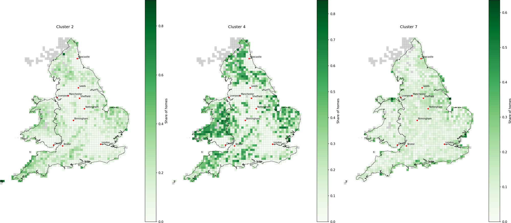
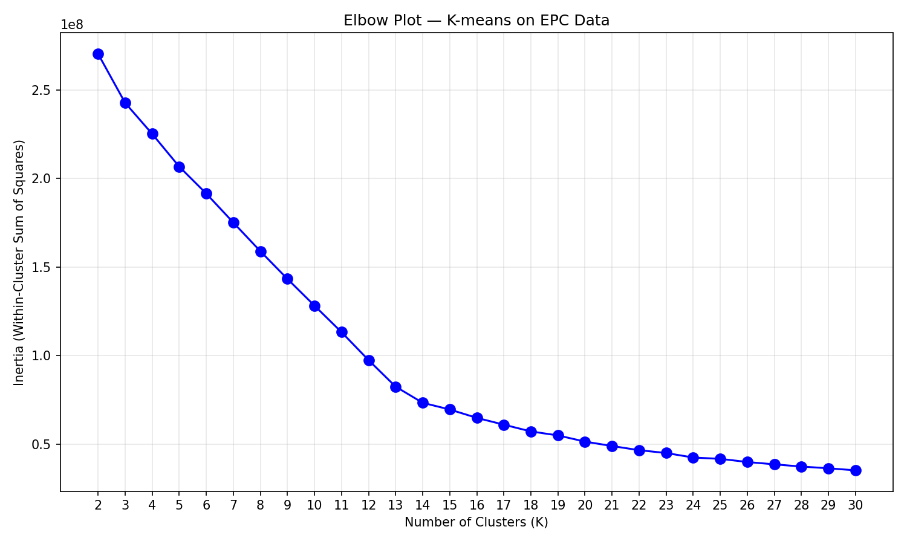
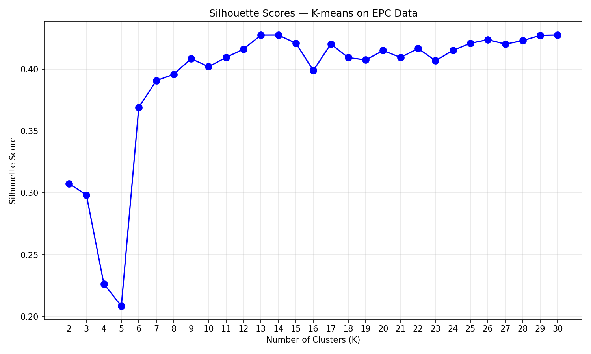
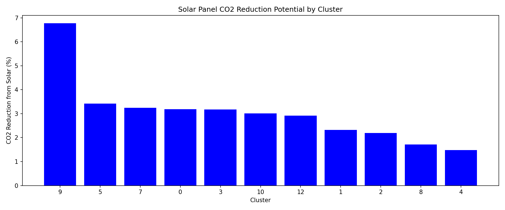
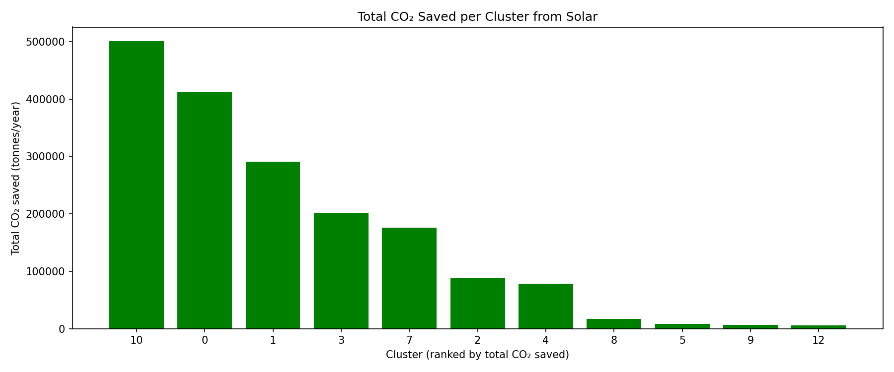

# Housing Archetypes for Rooftop Solar: Clustering 15M Homes in England and Wales

K-means clustering of every domestic Energy Performance Certificate (EPC) record in England and Wales, used to group 15.3 million homes into building archetypes and rank them by the CO₂ savings rooftop solar could deliver. MSc Data Science final project, King's College London (2026).



*Three of the eleven archetypes, mapped as each archetype's share of homes per 10 km grid cell. Left: electrically heated homes (cluster 2). Centre: oil and other-fuel homes, concentrated in rural Wales and the uplands (cluster 4). Right: bungalow-led homes, strongest along the coasts (cluster 7).*

## The question

Buildings are a major source of UK emissions, and rooftop solar is one of the most direct ways to cut them. But the housing stock is too varied to plan for home by home. This project asks:

1. **What building archetypes exist** in the domestic stock of England and Wales?
2. **How much CO₂ could rooftop solar save** in each archetype?
3. **Which archetypes should be prioritised**, and does the answer change depending on how "impact" is measured?

## Data

- **346 local-authority files** of domestic EPC records, 18,085,834 rows before cleaning.
- **15,347,969 homes** after deduplication (one record per building) and removal of invalid values.
- **63 features** common to all files, narrowed to 8 chosen for relevance to energy performance: floor area, energy efficiency score, energy rating, CO₂ emissions, CO₂ per m², property type, built form and main fuel.


## Method

| Step | Script | What it does |
|---|---|---|
| 1 | `01_eda.py` | Explores three contrasting local authorities (Blackpool, City of London, Westminster) to check missingness, duplication and feature correlations |
| 2 | `02_preprocessing.py` | Combines all 346 files, keeps one record per building, removes invalid values, consolidates fuel types, caps outliers at the 99th percentile, encodes categoricals (ordinal energy rating, one-hot for the rest) and standardises the resulting 20 columns |
| 3 | `03a` to `03d` | Tests K from 2 to 30 with the elbow method and silhouette scores, then fits the final model with k-means++ initialisation |
| 4 | `04_co2_ranking.py` | Estimates the CO₂ reduction from solar for each archetype |
| 5 | `05_archetypes.py` | Profiles each archetype and produces the ranking tables |
| 6 | `06_geography_maps.py` | Maps each archetype's share of homes on a 10 km grid, using British National Grid for equal-area cells |

**Choosing K.** The elbow plot bends gradually rather than sharply, so it was paired with silhouette scores. Silhouette scores climb until K=13, where they reach about 0.43 and then level off, so K=13 was chosen as the smallest value on that plateau. Two of the thirteen clusters held only 409 and 39 homes, so they were treated as noise, leaving 11 working archetypes.

<p float="left">
  
  
</p>


**Estimating savings.** Each home is assumed to self-consume 855 kWh of solar generation per year (McKenna et al.), multiplied by the SAP 10.2 grid emissions factor of 0.136 kg CO₂/kWh. That gives 116.28 kg CO₂ saved per home per year, compared against each archetype's average current emissions.

## Results

Across the 11 archetypes, rooftop solar on every home would save roughly **1.78 million tonnes of CO₂ per year**.

The central finding is that the two ways of ranking archetypes almost reverse each other:

<p float="left">
  
  
</p>

- **By percentage cut per home (left),** efficient, low-emission archetypes come out on top. Solar removes almost 7% of emissions in the best case, against about 1.5% for high-emission, oil-heated homes.
- **By total tonnes saved (right),** the largest archetypes dominate. The top two alone account for more than 900,000 tonnes a year, while the archetype with the best percentage cut saves under 10,000 tonnes because it is small.

For policy, the choice of metric decides the priority list. Targeting total tonnes points towards the large mainstream archetypes; targeting the proportional impact on each household points towards the efficient ones.


## Running it

```bash
git clone https://github.com/landondd/epc-solar-archetypes.git
cd epc-solar-archetypes
python -m venv venv && source venv/bin/activate
pip install -r requirements.txt
```

Put the data in place as described in [`data/README.md`](data/README.md), then run the scripts in order from the `src` folder (`01_eda.py` is exploratory and optional):

```bash
cd src
python 02_preprocessing.py
python 03a_kmeans_elbow.py
python 03b_kmeans_silhouette.py
python 03c_silhouette_plot.py
python 03d_kmeans_fit.py
python 04_co2_ranking.py
python 05_archetypes.py
python 06_geography_maps.py
```

All paths are set in `src/config.py`. Intermediate files go to `processed/`, and figures and tables to `outputs/`. At full scale, the K search (`03a` and `03b`) is the slow step, since it fits K-means 29 times on 15 million rows for each script.

## Stack

Python, pandas, NumPy, scikit-learn, GeoPandas, Shapely, Matplotlib, PyArrow.
